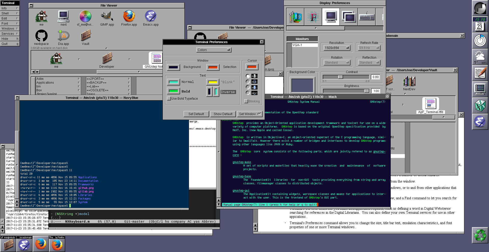

# NEXTSPACE

  

NEXTSPACE is a desktop environment that brings a [NeXTSTEP](https://en.wikipedia.org/wiki/NeXTSTEP) look and feel to Linux. I try to keep the user experience as close as possible to the original NeXT OS. It is developed according to the ["OpenStep User Interface Guidelines"](http://www.gnustep.org/resources/documentation/OpenStepUserInterfaceGuidelines.pdf).

> An explanation of the NeXTSTEP / NextStep naming convention is discussed in further detail [here](Documentation/OpenStep%20Confusion.md).

I want to create a fast, elegant, reliable, and easy to use desktop environment with maximum attention to user experience (usability) and visual maturity. I would like it to become a platform where applications will be running with a taste of NeXT's OS. Core applications such as Login, Workspace, and Preferences are the base for future application development and examples of visual style and application integration methods.

NEXTSPACE is not just a set of applications tightly integrated to each other. It is a core OS with frameworks, mouse cursors, fonts, colors, animations, and everything I think will help users to be effective and happy.

[Brief introduction](Applications.md) to core NEXTSPACE applications contains some details and screenshots.

## Why?
1. I like the look, feel, and design principles of NeXTSTEP.
2. I believe it will become an interesting environment for developers and comfortable (fast, easy to use, feature-rich) for users.

Unlike other 'real' and 'serious' projects, I have not yet defined a target audience for NEXTSPACE. I intentionally left aside modern UI design trends (fancy animations, shadows, gray blurry lines, flat controls, acid colors, transparency). I like the accurate, clear, grayish, and "boring" UI that helps, not hinder, to get my job done.

## Not planned
* Porting to other Linux distributions and operating systems. For now, I want a fast, accurate, and stable version for RedHat-based Linux distributions. Currently these are Fedora, CentOS Stream 9, Rocky Linux 9 and Alma Linux 9. However, NEXTSPACE was designed to be portable and thus this point may be changed in future.
* GNOME, KDE, macOS rival in terms of visual effects, modern design principles, look and feel.
* Implementing a macOS-like desktop paradigm. There is another good place for this -- see [Étoilé](http://etoileos.com).

## Installing
There are several methods of NEXTSPACE installation:
1. Get release builds [here](https://github.com/trunkmaster/nextspace/releases). At the time of writing there are RPM builds for CentOS 7, 8 and Fedora31. As of CentOS 7 EOL in 2024, no more CentOS builds will be created in the future. RPM packages will built for latest release of Fedora. Optionally may be created builds for stable Debian release and packed as a tarball.
2. Make own build of packages. Installation is based off CentOS 7's minimal install, you can find [full directions in the installation guide](https://github.com/trunkmaster/nextspace/wiki/Install-Guide).
3. Install it from source with help of build scripts (tested on Debian, Ubuntu LTS and Fedora). Please follow [build instructions](https://github.com/trunkmaster/nextspace/blob/master/Packaging/Sources/README.md) if you've choose this way.

## For developers
For those who are eager to know "How it's done?" can find information on development tasks, goals, solutions, implementation details, and build instructions on the [Wiki](https://github.com/trunkmaster/nextspace/wiki).
